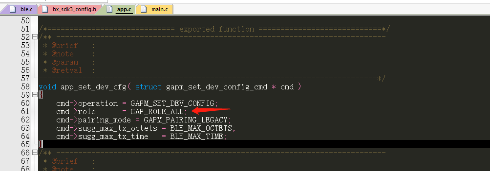

# 主从一体说明

## 1、概述

如何把工程配置成主从一体使设备可以发起广播也可以开启扫描


## 2、功能实现

想要配置成主从一体，首先需要配置设备的角色，找到app.c文件，在里面找到app_set_dev_cfg函数，把角色设置为all，这样就可以支持主从一体，如下所示

 


这样配置之后代码就同时支持主机和从机了


下面添加一些测试代码，方便演示主机和从机的功能，如下所示

在app.h中定义如下    

```c
enum user_msg_app {
    USM_APP_FIRST = BXM_FIRST_USER_MSG,
	USM_APP_STOP_ADV,
	USM_APP_START_SCAN
	};   
```
 

在app_init函数中添加如下

```c
/** ---------------------------------------------------------------------------
@brief   :
@note    :
@param   :
@retval  :
-----------------------------------------------------------------------------*/
void app_init( void )
{
 struct bx_service svc;
 svc.prop_set_func = NULL;
 svc.prop_get_func = NULL;
 svc.msg_handle_func = user_msg_handle_func;
 svc.name = "user service";
 user_service_id = bx_register( &svc );


 bx_defer( user_service_id, USM_APP_STOP_ADV, 0, 0, 10000 );

}
```


实现用户处理函数user_msg_handle_func

```c
/** ---------------------------------------------------------------------------

@brief   :

@note    :

@param   :

@retval  :
-----------------------------------------------------------------------------*/
bx_err_t user_msg_handle_func( s32 svc, u32 msg, u32 param0, u32 param1 )
{
 s32 msg_src = bx_msg_source();
 if( msg_src == user_service_id ) {
     switch( msg ) {
         case USM_APP_STOP_ADV:
             ble_advertising_stop();
             bx_defer( user_service_id, USM_APP_START_SCAN, 0, 0, 1000 );
             break;
         case USM_APP_START_SCAN:
             app_ble_scan();
             break;
     default:
         break;
 }

 }
 return BX_OK;
}
```

代码整个功能是上电默认开启广播，10s后关掉广播，1s之后开启扫描；扫描函数不了解请参考scan相关文档


## 3、功能验证


1、广播信号可以使用手机下载nrfconnect软件查看信号，这里名称是BX-SDK3

2、scan是否成功运行，可以看到RTT viewer的log，停止广播开启扫描之后，扫描到的广播和scan_rsp以及rssi数据，如下图所示

 


